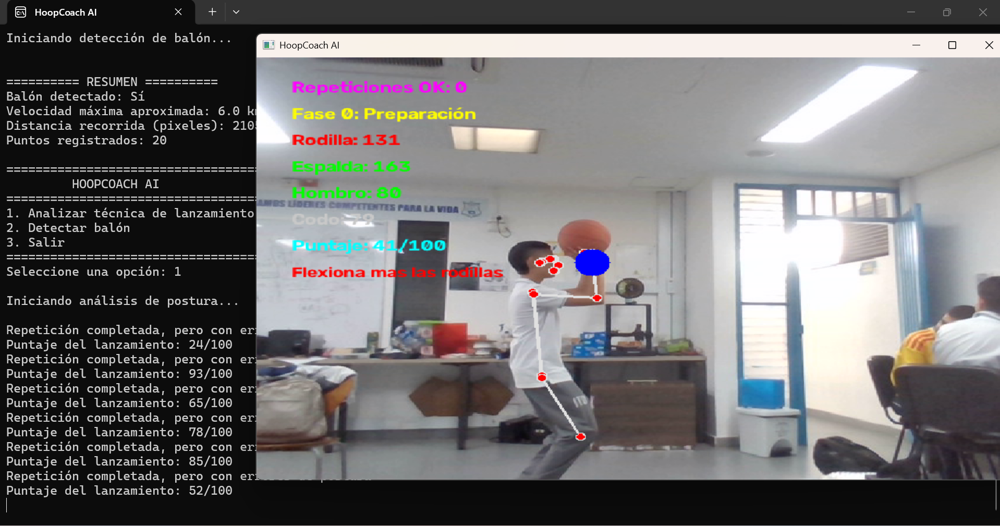

# Hoopcoach-ai

    

<h2 align="center">
Computer vision tool that helps basketball players improve their shooting technique
</h2> 

Hi, I’m Chanty_30 and Jerogonzax15, and we created **Hoop Coach AI** as a project for Hack Club’s Macondo program. My goal is to build a tool for basketball players to help them improve their performance and shooting mechanics.

You can find us on the Hack Club Slack as: `@Chanty_30` `@Jerogonzax15`

HoopCoach AI is a Python-based virtual basketball coach that uses Computer Vision and Artificial Intelligence to analyze player performance. The system captures real-time video through a webcam, detects and tracks the basketball using the YOLO object detection model, and evaluates its trajectory, speed, and movement to assist players during training and improve their shooting performance.

# libraries used

| Technology | Function  |
|------------|-----------------|
| Python | Main language |
| OpenCV | Video capture and processing |
| MediaPipe  | body detection |
| NumPy | Numerical processing |
| YOLO | Object detection |

## Download the program

You can download the executable version for Windows from the releases section:

[**Download HOOPCOACH-AI**](https://github.com/santiagograja4430-ship-it/hoopcoach-ai/releases/tag/v1.0.0)

### Usage Instructions

1. Download Hoop Coach AI-Windows-v1.0.zip.
2. Extract the folder completely.
3. Open the Hoop Coach AI folder.
4. Run HoopCoachAI.exe.

> the executable must remain alongside the _internal folder and the other included files. If the folder is deleted, the executable will not work.
